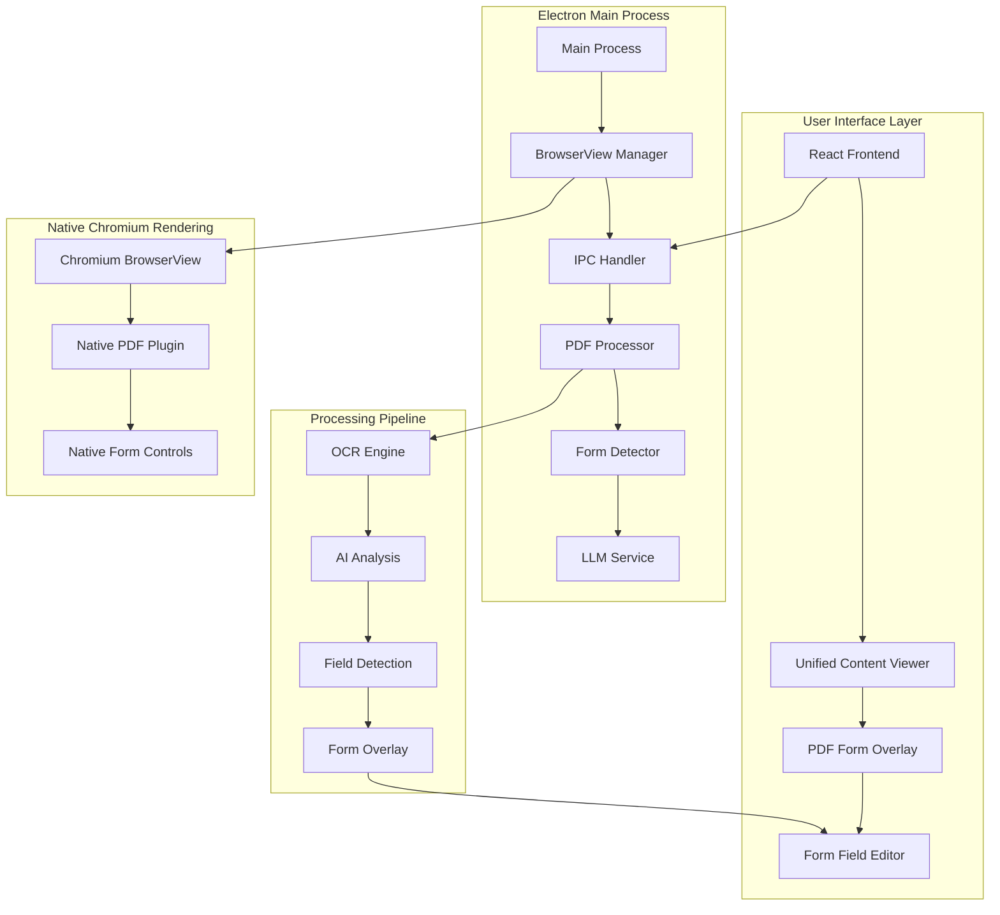
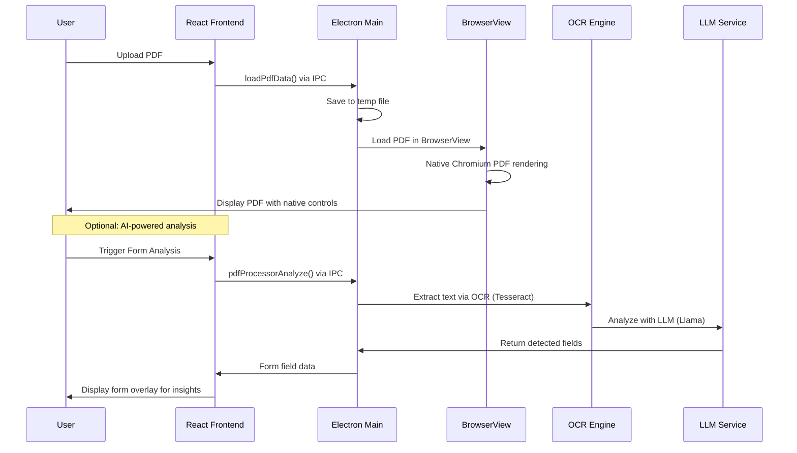
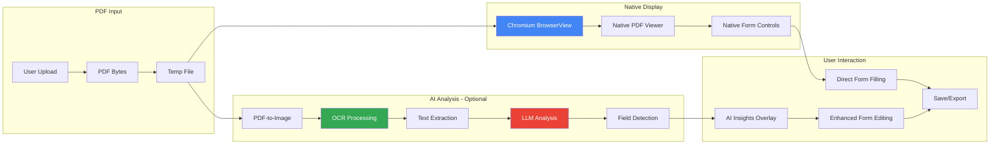
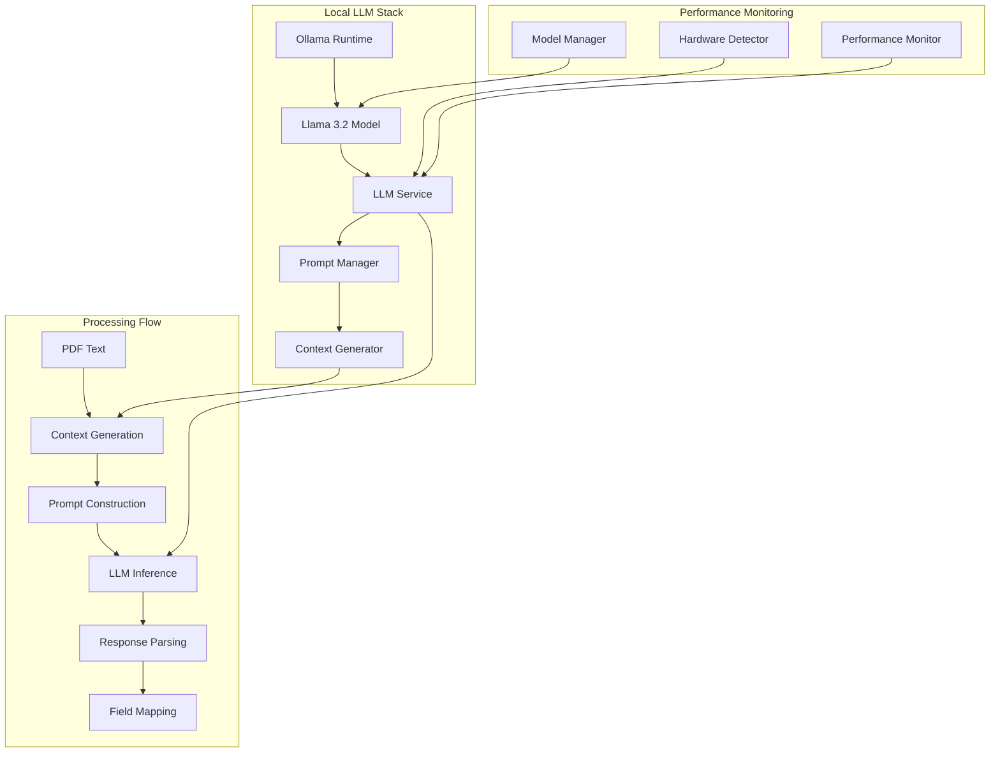
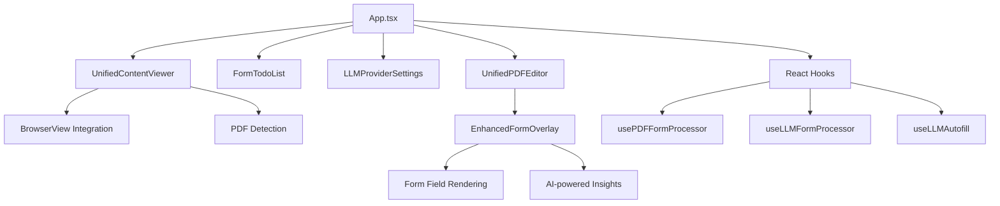
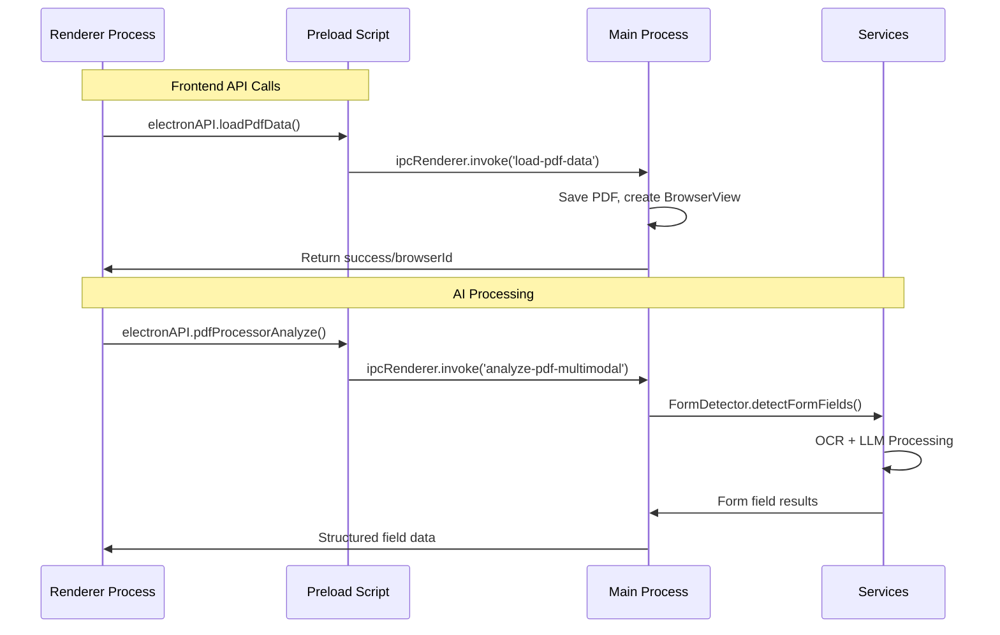
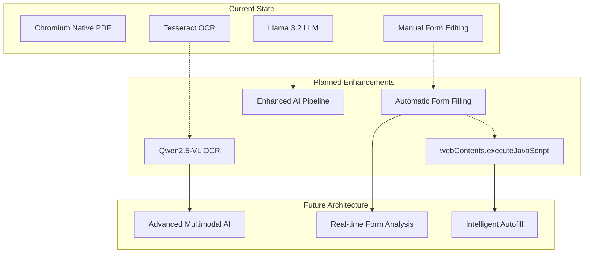

# InkFlow Technical Design

_Single source of truth for current architecture - Always updated, no versions_

**Last Updated**: September 16, 2025 - Post AcroForm/PDF.js removal simplification

---

## 🏗️ **Current Architecture Overview**

### **High-Level System Design**

---

## 📄 **PDF Processing Workflow**

### **Simplified Post-Removal Architecture**

---

## 🔄 **Data Flow Architecture**

### **Current Processing Pipeline**

---

## 🧠 **LLM Integration Architecture**

### **Local AI Processing**

---

## 📱 **Component Architecture**

### **Frontend Component Hierarchy**

---

## 🔌 **IPC Communication Design**

### **Main ↔ Renderer Communication**

---

## 🎯 **Next Architecture Evolution**

### **Planned Enhancements**

---

## 📊 **Performance Targets**

### **Current Metrics**

- **PDF Load Time**: 1-2 seconds (60% improvement)
- **Memory Usage**: 40% reduction vs previous architecture
- **Bundle Size**: 2MB+ smaller (PDF.js removal)
- **LLM Response**: <3 seconds P95 latency
- **OCR Processing**: 5-10 seconds per page

### **Architecture Benefits**

- ✅ **Single Rendering Path**: Chromium only
- ✅ **Native Performance**: Browser-grade PDF handling
- ✅ **Reduced Complexity**: No redundant layers
- ✅ **Better UX**: Native form controls
- ✅ **Maintainable**: Clean, focused codebase

---

_This design document reflects the current post-simplification architecture and will be updated as the system evolves._
